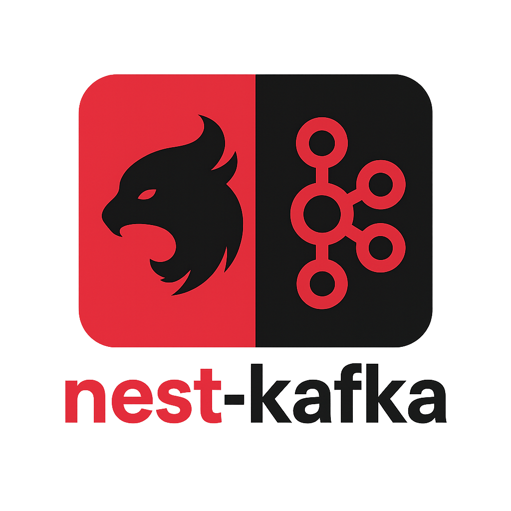

<p align="center">
  </a>
</p>

[circleci-image]: https://img.shields.io/circleci/build/github/nestjs/nest/master?token=abc123def456
[circleci-url]: https://circleci.com/gh/nestjs/nest

  <p align="center">A progressive <a href="http://nestjs.com" target="_blank">Node.js</a> boilerplate for building efficient and scalable <a href="https://www.confluent.io" target="_blank">confluent-kafka</a> server-side applications.</p>
    <p align="center">
<a href="https://www.npmjs.com/~nestjscore" target="_blank"></a>
<a href="https://circleci.com/gh/nestjs/nest" target="_blank"></a>
</p>
  <!--[](https://opencollective.com/nest#backer)
  [](https://opencollective.com/nest#sponsor)-->


## Project setup

```bash
$ npm install
```

## Compile and run the project

```bash
# development
$ npm run start

# watch mode
$ npm run start:dev

# production mode
$ npm run start:prod
```

## Run tests

```bash
# unit tests
$ npm run test

# e2e tests
$ npm run test:e2e

# test coverage
$ npm run test:cov
```

## Deployment

When you're ready to deploy your NestJS application to production, there are some key steps you can take to ensure it runs as efficiently as possible. Check out the [deployment documentation](https://docs.nestjs.com/deployment) for more information.

If you are looking for a cloud-based platform to deploy your NestJS application, check out [Mau](https://mau.nestjs.com), our official platform for deploying NestJS applications on AWS. Mau makes deployment straightforward and fast, requiring just a few simple steps:

```bash
$ npm install -g @nestjs/mau
$ mau deploy
```

With Mau, you can deploy your application in just a few clicks, allowing you to focus on building features rather than managing infrastructure.

# Kafka Module Overview

This module implements a **Dedicated Topic Service** pattern using Kafka with NestJS. Each service handles one topic with its own consumer group, allowing independent scaling and clean separation of concerns.

---

## 📁 Directory Structure

```bash
src/communication/kafka
├── config
│   ├── kafka.config.ts              # Loads and validates Kafka environment variables
│   └── kafka-config.type.ts         # Type definitions for Kafka configuration
├── logger
│   ├── kafka-logger.decorator.ts    # NestJS-compatible logger decorator for Kafka messages
│   └── kafka-logger.ts              # Logger class for handling Kafka logs and events
├── types
│   ├── kafa-const.enum.ts           # Enumerations for default config values
│   ├── kafa-const.type.ts           # Constants and fallback defaults
│   └── kafka-interface.type.ts      # Shared interface types used across Kafka consumers
├── utils                            # Utility functions/helpers (optional)
├── kafka.consumer.ts                # Main consumer logic (create and consume topic messages)
├── kafka.module.ts                  # KafkaModule that registers all providers
├── kafka.processor.ts               # Handles actual business logic for messages
└── kafka.service.ts                 # Service to initialize and shutdown Kafka consumer
```

---

## 📦 Features (Planned & Implemented)

- [x] Dedicated consumer instance per topic
- [x] One consumer group per topic
- [x] Auto reconnect and retry on failure
- [x] Configurable SSL, partitions, commit settings
- [x] Clean and minimal structure (no over-splitting)
- [x] Pluggable processor logic per topic
- [x] Scalable per service (Kubernetes-ready)
- [ ] BullMQ integration for async processing
- [ ] Worker threads for CPU-intensive deserialization
- [ ] Batch DB writes for improved throughput
- [ ] Schema validation (e.g., Protobuf/Avro)
- [ ] Rate limiting per topic
- [ ] OpenTelemetry metrics and tracing
- [ ] DLQ (Dead Letter Queue) support
- [ ] Multi-tenant topic handling
- [ ] Runtime consumer health checks
- [ ] Generate stable per-topic group ID strategy (e.g., `consumer-my-topic-prod`)

---

## 🎯 Kafka Consumption Strategy

### **Dedicated Topic Service**

* 🧩 One service = one topic
* 🧵 One Kafka consumer per service
* 📊 Each topic has its **own group ID**
* 📈 Microservice pattern, allows **independent scaling**
* 🛠️ Ideal for Kubernetes deployments with different replica counts


### Parallel Processing & K8s Scaling

```
                           +---------------------+
                           |  Kafka Cluster      |
                           |  (3 Topics × 20     |
                           |   Partitions each)  |
                           +----------+----------+
                                      |
                                      v
                    +------------------------------------+
                    |      Kubernetes Cluster (K8s)      |
                    |   (Horizontal Pod Autoscaler)      |
                    +----------------+-------------------+
                                     |
          +--------------------------+---------------------------+
          |                          |                           |
  +---------------+        +----------------+         +----------------+
  | NestJS Pod #1 |        | NestJS Pod #2  |         | NestJS Pod #3  |
  |  - Consumer A |        |  - Consumer A  |         |  - Consumer A  |
  |  - Consumer B |        |  - Consumer B  |         |  - Consumer B  |
  |  - Consumer C |        |  - Consumer C  |         |  - Consumer C  |
  +---------------+        +----------------+         +----------------+
          |                          |                           |
          |                          |                           |
+--------------------+  +----------------------+  +------------------------+
|  Topic 1 (20 parts) |  |  Topic 2 (20 parts)  |  |  Topic 3 (20 parts)    |
+--------------------+  +----------------------+  +------------------------+

Each consumer belongs to the same **Group ID** per topic.
Only **1 consumer per partition** (Kafka guarantees).
```

---

## 🛠️ Design Pattern

* NestJS Modules: Encapsulation via `KafkaModule`
* Dependency Injection: For consumer, config, and logger
* Clean Code: Limited file count, single-responsibility design
* Observable: Ready for metrics/logging/health checks

---

## 🚀 Quickstart

```ts
// kafka.module.ts
@Module({
  providers: [KafkaService, KafkaProcessor, KafkaLogger, KafkaConfig],
})
export class KafkaModule {}

// app.module.ts
@Module({
  imports: [KafkaModule],
})
export class AppModule {}
```

---

## ✅ Good Practices

* One consumer group per topic
* Avoid mixing topics in one app
* Always handle errors and retries
* Ensure offset commits after processing

---

Feel free to scale each Kafka microservice independently based on load!
